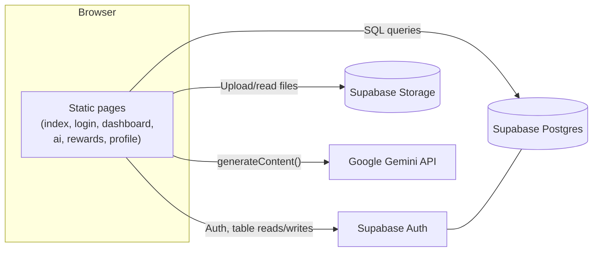
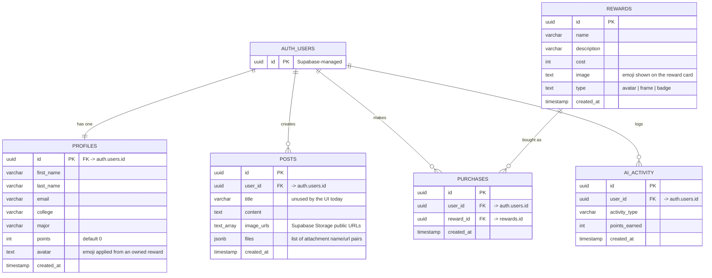

# CUNY Connect

**A CUNY-only student platform to connect, get AI-powered study help, and earn rewards for staying active on campus.**

Built in one day at **CTP Hacks 2026** (CUNY Tech Prep's MLH Hack Day), powered by Google Gemini.

[](https://devpost.com/software/cunyconnect-eyj35f)


**[View on Devpost →](https://devpost.com/software/cunyconnect-eyj35f)**

---

## Table of contents

- [Overview](#overview)
- [Features](#features)
- [Tech stack](#tech-stack)
- [Architecture](#architecture)
- [Database schema](#database-schema)
- [Project structure](#project-structure)
- [Getting started](#getting-started)
- [Security notes](#security-notes)
- [Known limitations](#known-limitations)
- [Roadmap](#roadmap)

## Overview

CUNY's 25+ campuses don't share a common online space — students post in scattered group chats, study help is limited to office hours, and there's no reason to stay engaged beyond the classroom. CUNY Connect is a single, CUNY-only platform built around three pillars: a campus-wide feed, a Gemini-powered AI study assistant, and a points economy that rewards participation.

## Features

- **Campus Feed** — post a question, find a study group, or sell a textbook, with photo and file attachments, visible to every signed-in CUNY student.
- **CUNY AI** — paste lecture notes and get a summary, flashcards, a quiz, an ELI5 explanation, or a study plan, generated by Gemini.
- **CUNY Points & Rewards** — earn points for posting, then spend them on avatars, frames, and badges. Owned avatars can be applied to your profile instantly.
- **CUNY-wide sign-up** — every senior college, community college, and CUNY graduate/professional school is available at sign-up.

## Tech stack

| Layer | Technology |
|---|---|
| Frontend | Plain HTML, CSS, and JavaScript (ES modules) — no framework, no build step |
| Auth & database | [Supabase](https://supabase.com) (Postgres) |
| File storage | Supabase Storage (post photo/file attachments) |
| AI | [Google Gemini API](https://ai.google.dev/), called directly from the browser with structured JSON output |

## Architecture



There is no application backend — the frontend talks to Supabase and Gemini directly from the browser. That's a deliberate hackathon-speed tradeoff (see [Security notes](#security-notes)).

## Database schema



> **Note:** `posts`, `purchases`, and `ai_activity` each reference `auth.users` directly rather than `profiles` — there's no foreign key between them and `profiles`. The frontend resolves an author's name for the feed with a second query into `profiles` keyed on the same user id (see `js/dashboard.js`). Row Level Security is not enabled on any table — an accepted tradeoff for a one-day build, not something to carry into a real deployment.

See [`supabase/schema.sql`](supabase/schema.sql) for the full DDL, including Storage bucket setup notes.

## Project structure

```
cuny-connect-vanilla/
├── index.html          # public landing page
├── login.html          # sign up / sign in
├── dashboard.html       # campus feed
├── ai.html              # CUNY AI study assistant
├── rewards.html         # points shop
├── profile.html         # profile + owned rewards
├── css/
│   └── style.css        # shared design system (tokens, components, pages)
├── js/
│   ├── config.js         # Supabase + Gemini keys (never commit real keys)
│   ├── supabase.js       # Supabase client + shared helpers (requireAuth, getMyProfile, ...)
│   ├── gemini.js          # direct-from-browser Gemini calls
│   ├── auth.js, dashboard.js, ai.js, rewards.js, profile.js   # one script per page
├── assets/               # brand/logo assets
└── supabase/
    └── schema.sql        # database schema reference + setup notes
```

## Getting started

1. **Create a Supabase project** and copy your Project URL and `anon` public key into `js/config.js`.
2. **Run [`supabase/schema.sql`](supabase/schema.sql)** in the Supabase SQL editor to create the tables (and the optional reward-seeding insert near the bottom of the file).
3. **Create two Storage buckets** — `post-photos` and `post-files`, both set to **Public** — for the feed's photo/file attachments. Add the insert/select policies documented at the top of `schema.sql`.
4. **Turn off email confirmation**: Authentication → Providers → Email → toggle off "Confirm email", so signups don't need to click a confirmation link.
5. **Add your Gemini API key** to `js/config.js` and confirm `GEMINI_MODEL` matches an available model.
6. **Serve the site with a local static server** — ES modules don't work over `file://`. VS Code's Live Server extension, `npx serve`, or `python3 -m http.server` all work.

## Security notes

- The Gemini API key lives in `js/config.js` and is called directly from the browser, so it's visible in DevTools → Network. Accepted for hackathon speed in a private repo — do not ship this pattern with a real key in a public app. Moving the Gemini call behind a Supabase Edge Function is the correct long-term fix.
- Row Level Security is not enabled on any table. Any signed-in request can currently read or write any row.
- Storage buckets are public — anyone with a file's URL can view it, no auth check.

## Known limitations

- Reward "avatars" are emoji, not illustrated art or uploaded images.
- Frame/badge-type rewards show as owned but aren't visually applied anywhere yet — only avatar-type rewards change what's shown in the avatar circle.
- No mobile-specific testing pass yet.

## Roadmap

- Real avatar images instead of emoji
- Row Level Security policies so users can only modify their own data
- Bring back AI-assisted categorization for feed posts
- Reintroduce features cut for time: mystery boxes, badges/achievements, a cross-campus leaderboard
- Public deployment
